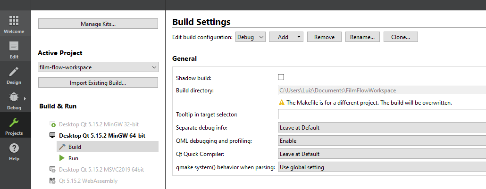
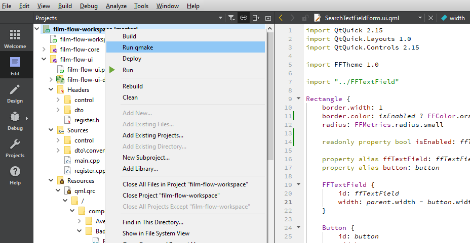

## Film Flow Wokspace

- Esse projeto faz junção de alguns outros projetos, com objetivo de facilitar a configuração e administração do ambiente.

### Inicialização 

- Na raiz desse projeto existe um init-workspace.sh e um init-workspace.bat, caso voce utilize sistemas unix pode estar utilizando o .sh, caso utilize windows pode utilizar o .bat

- Esses arquivos de inicialização baixam direto do projeto principal, e trazem já na branch main, futuramente podem ser customizados para respeitar fork/branch.

### Projetos

- É Possível encontrar dados sobre todas os APPs no README.MD de cada um.

| Name | Link |
| ------ | ------ |
| FilmFlowUI | https://gitlab.com/luizhs331/film-flow-ui |
| FilmFlowCore | https://gitlab.com/luizhs331/film-flow-core |
| HttpRequest | https://gitlab.com/luizhs331/http-request |

### Dependências

- Existe uma pasta `share` e dentro dela existem outras duas pastas, `dll` e `lib`, essas pastam servem para guardar dependecias de libs não geradas pelo projeto em si.

| Name | versão | Fonte |
| ------ | ------ |  ------ |
| OpenSSL | 1.1.1 | https://slproweb.com/products/Win32OpenSSL.html |

- A principio e para funcionar corretamente sem precisar baixar nada adicional, pois o .pro aponta para a lib/dll do workspace. ( Não foi testado em sistema unix )

| Name | versão |
| ------ | ------ |
| Kit Qt | 5.15.2 |
| C++    | 17 |

- Esse projeto foi desenvolvido com a Qt 5.15.2, mas muito provável que funcione com versões anteriores, como 5.12...

- A versão do C++ segue a mesma premissa, foi desenvolvido com C++17, mas pode ser utilizado C++11 

### Rodar projeto

- Com o projeto aberto no QT, vai ser necessário selecionar a opção no menu lateral a esquerda `Projects` após isso selecionar `Build` no Kit de desenvolvimento, e em seguida desabilitar a flag `Shadow build`, isso é necessário pois configuramos manualmente o destino dos nossos arquivos de build, por padrão eles ficaram em `/build`, no diretório do APP.

- Apos isso basta rodar um `clean/run qmake/build` e a aplicação deve compilar corretamente, apois isso so rodar.

